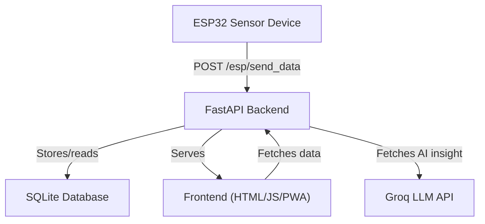

# GreenGuard 🌿 — Full Project Documentation

Welcome to the comprehensive documentation for the **GreenGuard - Carbon Tracker** platform!  
This project helps users track their carbon footprint and air quality in real-time using IoT sensors, a modern web dashboard, and AI-powered insights.

---

## 📑 Index

1. [Overview](#overview)
2. [Project Architecture](#project-architecture)
3. [Backend Files](#backend-files)
    - [main.py](#mainpy)
    - [database.py](#databasepy)
    - [models.py](#modelspy)
    - [auth.py](#authpy)
    - [users.py](#userspy)
    - [admin.py](#adminpy)
    - [meter.py](#meterpy)
    - [esp32.py](#esp32py)
    - [ai.py](#aipy)
4. [Frontend Files](#frontend-files)
    - [index.html](#indexhtml)
    - [dashboard.html](#dashboardhtml)
    - [signup.html](#signuphtml)
    - [notification.html](#notificationhtml)
    - [settings.html](#settingshtml)
    - [manifest.json](#manifestjson)
    - [service-worker.js](#service-workerjs)
5. [Device Integration](#device-integration)
    - [device.ino](#deviceino)
6. [Requirements](#requirementstxt)
7. [Mermaid Diagrams](#mermaid-diagrams)

---

## Overview

**GreenGuard** aims to empower users to monitor and reduce their carbon footprint and improve air quality awareness. It features:

- IoT integration (ESP32 and sensors)
- Real-time dashboard with visualization
- User authentication and management
- AI insights for greener living
- Progressive Web App (PWA) capabilities

---

## Project Architecture



---

## Backend Files

### main.py

**Purpose:**  
The entry point of the FastAPI application.  
Initializes app, middleware, database, and includes all routers.

**Key Elements:**

- Adds CORS for cross-origin requests.
- Creates all tables in the database on startup.
- Includes routers for admin, auth, meter, users, esp32, and ai.
- Health endpoint `/ping`.

**Code Structure:**

```python
from fastapi import FastAPI
import models
from routers import auth, admin, meter, users, esp32, ai
from fastapi.middleware.cors import CORSMiddleware
from database import engine

app = FastAPI()

app.add_middleware(
    CORSMiddleware,
    allow_origins=["*"],
    allow_credentials=True,
    allow_methods=["*"],
    allow_headers=["*"],
)

models.Base.metadata.create_all(bind=engine)

app.include_router(admin.router)
app.include_router(auth.router)
app.include_router(meter.router)
app.include_router(users.router)
app.include_router(esp32.router)
app.include_router(ai.router)

@app.get('/ping')
async def send_data():
    return { "status":"ping" }
```

---

### database.py

**Purpose:**  
Sets up the SQLAlchemy ORM database connection and session.

**Key Elements:**

| Name              | Type             | Description                    |
|-------------------|------------------|--------------------------------|
| `engine`          | SQLAlchemy Engine| Connects to SQLite DB          |
| `SessionLocal`    |