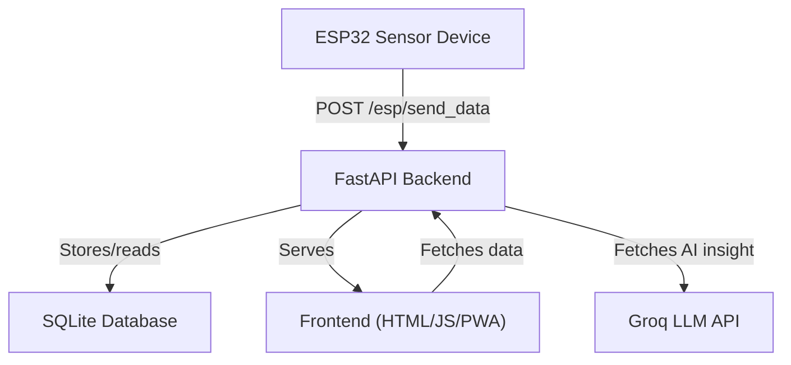
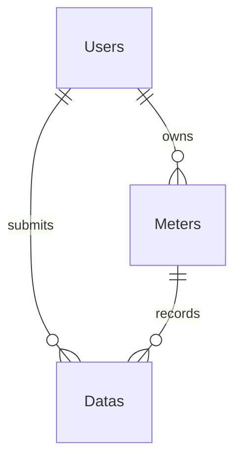
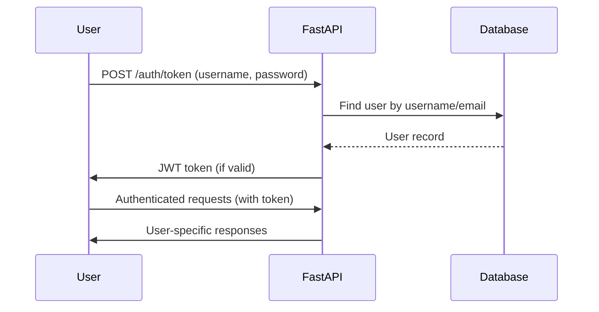
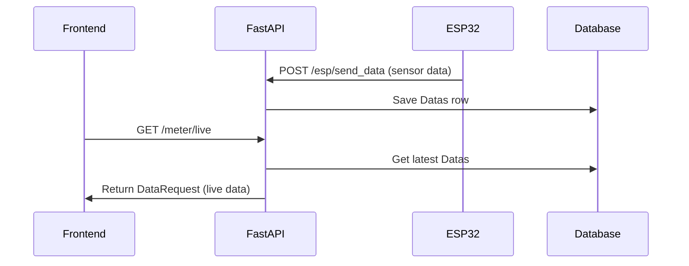
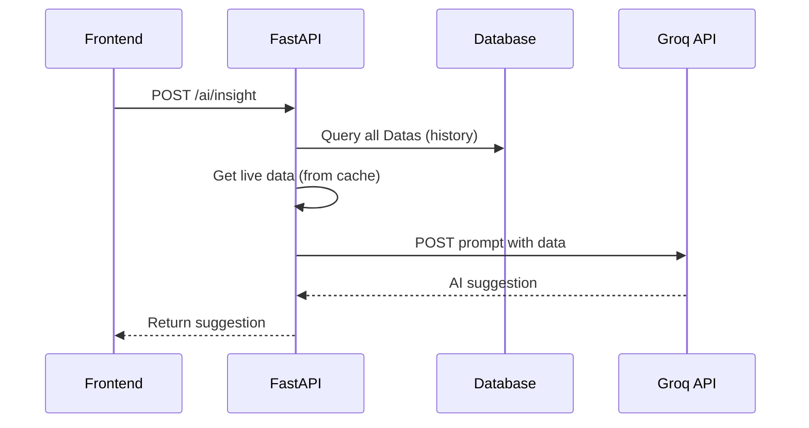
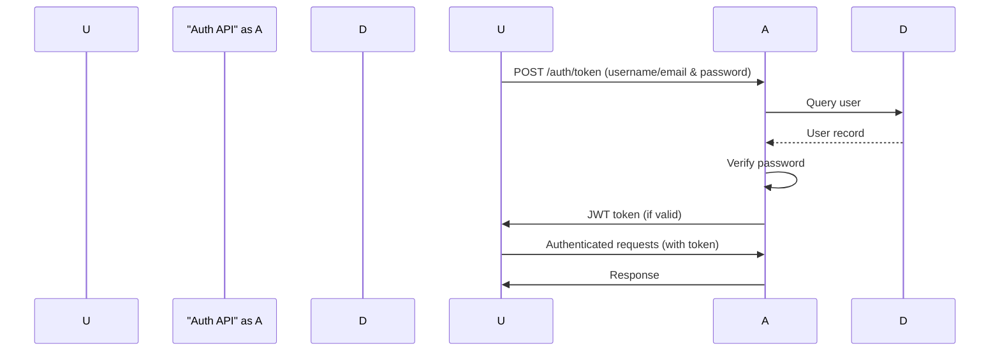
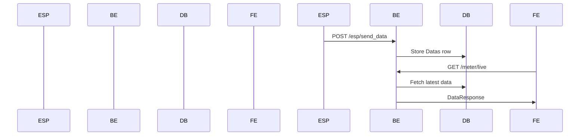
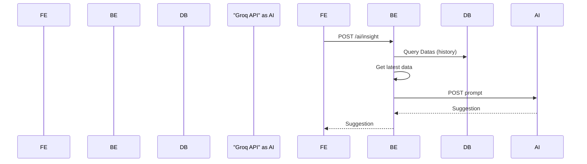
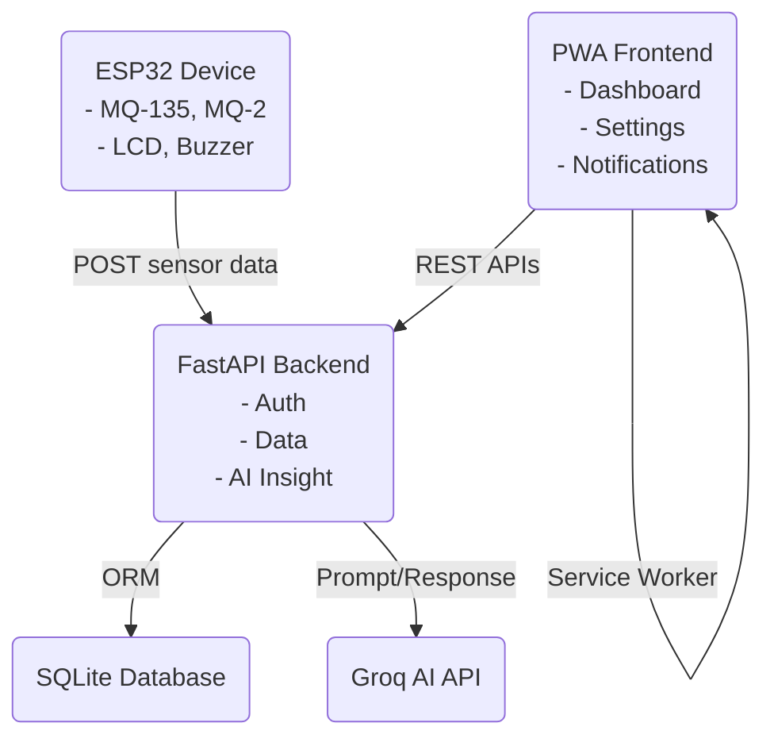

# GreenGuard 🌿 — Full Project Documentation

Welcome to the comprehensive documentation for the **GreenGuard - Carbon Tracker** platform!  
This project helps users track their carbon footprint and air quality in real-time using IoT sensors, a modern web dashboard, and AI-powered insights.

---

## 📑 Index

1. [Overview](#overview)
2. [Project Architecture](#project-architecture)
3. [Backend Files](#backend-files)
    - [main.py](#mainpy)
    - [database.py](#databasepy)
    - [models.py](#modelspy)
    - [auth.py](#authpy)
    - [users.py](#userspy)
    - [admin.py](#adminpy)
    - [meter.py](#meterpy)
    - [esp32.py](#esp32py)
    - [ai.py](#aipy)
4. [Frontend Files](#frontend-files)
    - [index.html](#indexhtml)
    - [dashboard.html](#dashboardhtml)
    - [signup.html](#signuphtml)
    - [notification.html](#notificationhtml)
    - [settings.html](#settingshtml)
    - [manifest.json](#manifestjson)
    - [service-worker.js](#service-workerjs)
5. [Device Integration](#device-integration)
    - [device.ino](#deviceino)
6. [Requirements](#requirementstxt)
7. [Mermaid Diagrams](#mermaid-diagrams)

---

## Overview

**GreenGuard** aims to empower users to monitor and reduce their carbon footprint and improve air quality awareness. It features:

- IoT integration (ESP32 and sensors)
- Real-time dashboard with visualization
- User authentication and management
- AI insights for greener living
- Progressive Web App (PWA) capabilities

---

## Project Architecture



---

## 🐍 Backend Python Files

### main.py

**Purpose:** Entry point for the FastAPI application. Initializes API, database models, middlewares, and includes all routers.

**Main Features:**
- CORS middleware for frontend-backend communication.
- Creates database tables at startup.
- Includes routers for authentication, admin, user, meter, ESP32, and AI endpoints.
- Provides a `/ping` health check endpoint.

```python
app = FastAPI()
app.add_middleware(CORSMiddleware, ...)
models.Base.metadata.create_all(bind=engine)
app.include_router(admin.router)
app.include_router(auth.router)
app.include_router(meter.router)
app.include_router(users.router)
app.include_router(esp32.router)
app.include_router(ai.router)

@app.get('/ping')
async def send_data():
    return { "status":"ping" }
```

---

### database.py

**Purpose:** SQLAlchemy setup for SQLite database.

| Object          | Purpose                                         |
|-----------------|-------------------------------------------------|
| `engine`        | SQLAlchemy engine with SQLite file (`data.db`).  |
| `SessionLocal`  | Session factory for DB sessions.                |
| `Base`          | Declarative base for models.                    |

---

### models.py

**Purpose:** Defines ORM database models.

#### Tables:

| Table Name | Class    | Description                              |
|------------|----------|------------------------------------------|
| users      | Users    | User accounts                            |
| meters     | Meters   | Physical meter devices                   |
| datas      | Datas    | Air quality and carbon data records      |

#### Example (simplified):

```python
class Users(Base):
    __tablename__ = 'users'
    id = Column(Integer, primary_key=True)
    first_name = Column(String)
    last_name = Column(String)
    username = Column(String)
    email = Column(String)
    hashed_password = Column(String)
```

#### Database Model Relationships



---

### auth.py

**Purpose:** User authentication, signup, and token issuance via OAuth2/JWT.

#### Features:
- **JWT-based Auth:** Issues, verifies tokens.
- **Password Hashing:** Uses bcrypt.
- **User Registration:** Registers new users.
- **Login:** Supports username or email login.

#### Endpoints:

| Endpoint     | Method | Description                |
|--------------|--------|----------------------------|
| `/auth/`     | POST   | User registration          |
| `/auth/token`| POST   | Login, returns JWT token   |

#### JWT Auth Sequence



---

### users.py

**Purpose:** User profile management (view/edit) and password change.

#### Features:
- **Get User Details:** Authenticated.
- **Edit Details:** Authenticated, updates first name, last name, email.
- **Change Password:** Authenticated, old password required.

| Endpoint                 | Method | Description                    |
|--------------------------|--------|--------------------------------|
| `/user/`                 | GET    | Get user details               |
| `/user/edit`             | POST   | Edit user details              |
| `/user/change_password`  | POST   | Change user password           |

---

### admin.py

**Purpose:** (Stub) Placeholder for admin/smart meter management endpoints.

- Sets up a router for `/meter` endpoints.
- Prepares DB dependency injection, but doesn't implement endpoints yet.

---

### meter.py

**Purpose:** Carbon meter endpoints for live and historical data.

#### Features:
- **/meter/history:** Returns all air quality data for history.
- **/meter/live:** Returns latest data from the device, checks data freshness.

| Endpoint         | Method | Description                                 |
|------------------|--------|---------------------------------------------|
| `/meter/history` | GET    | List all past carbon data                   |
| `/meter/live`    | GET    | Get latest data from ESP32 (with freshness) |

#### Live Data Flow



---

### esp32.py

**Purpose:** Handles communication with ESP32 device for data ingestion and retrieval.

#### Features:
- **/esp/send_data:** ESP32 posts sensor data here. Data is stored in DB, and global cache is updated.
- **DataRequest Model:** Used for both validation and live data representation.
- **get_latest_data():** Dependency to retrieve the most recent data.

---

### ai.py

**Purpose:** Integrates with external AI API (Groq/OpenAI) to generate user insights.

#### Features:
- **/ai/insight:** POST endpoint generates an environmental suggestion (max 2 sentences) based on historical and live sensor data. Calls Groq API.

| Endpoint       | Method | Description                                  |
|----------------|--------|----------------------------------------------|
| `/ai/insight`  | POST   | Get AI-generated environmental insight       |

#### AI Insight Request Flow



---

## 🤖 ESP32 IoT Firmware

### device.ino

**Purpose:** Runs on ESP32, reads sensor data (MQ-135 for CO₂, MQ-2 for gas), displays status on LCD, triggers buzzer warnings, and posts data to backend.

#### Main Features:
- **WiFi Connection:** Connects to local WiFi.
- **Sensor Reading:** Analog reads from MQ-135 and MQ-2.
- **Data Classification:** Maps readings to statuses ("Excellent", "Good", "Moderate", "Poor", "Dangerous").
- **Alerting:** Buzzer and LCD feedback for dangerous values.
- **Time Sync:** Uses NTP servers for timestamps.
- **HTTP POST:** Sends data as JSON to `/esp/send_data` on backend.

---

## 🌍 Frontend Files

### index.html

**Purpose:** Login page for GreenGuard.

- **Form:** Username/email + password.
- **Script:** On submit, POSTs to `/auth/token`, stores JWT in localStorage, redirects to dashboard on success.
- **Design:** Uses Tailwind CSS for responsive design.

---

### dashboard.html

**Purpose:** Main user dashboard for live data visualization and AI insights.

- **Live Data:** Fetches from `/meter/live`.
- **Gauge & Charts:** Visualizes latest and historical data (Chart.js).
- **AI Insights:** Fetches AI advice from `/ai/insight`.
- **Eco Score:** Computed from current air quality status.
- **PWA:** Registers service worker for offline support.
- **Tips:** Static cards for green lifestyle advice.
- **Navigation:** Bottom nav bar for switching views.

---

### signup.html

**Purpose:** User registration page.

- **Form:** First name, last name, email, username, password.
- **Script:** Submits to `/auth/` endpoint, handles success/failure.
- **Design:** Consistent with index.html.

---

### notification.html

**Purpose:** Notification center UI.

- **Lists:** "Today" and "Yesterday" notifications (static).
- **Design:** Clean, mobile-friendly list with icons.

---

### settings.html

**Purpose:** Settings page for user and device configuration.

- **Sections:** Account, Device, App, Support, About.
- **Design:** Uses Tailwind, icons, and clear sectioning.

---

### manifest.json

**Purpose:** PWA manifest for installable app behavior.

| Field         | Value                                  |
|---------------|----------------------------------------|
| name          | GreenGuard - Carbon Tracker            |
| short_name    | GreenGuard                            |
| description   | Track your carbon footprint & air quality |
| start_url     | ./index.html                           |
| display       | standalone                             |
| theme_color   | #43a047                                |
| icons         | 192x192, 512x512 PNGs                  |

---

### service-worker.js

**Purpose:** Enables offline capability for PWA.

- **Caches:** Root, index, manifest, and icons on install.
- **Fetch Event:** Tries cache first, falls back to network.

---

## 📦 requirements.txt

**Purpose:** Python package dependencies.

```txt
fastapi==0.115.5
uvicorn
sqlalchemy
python-jose
python-multipart
bcrypt
passlib
httpx
```
*Supports all backend, authentication, DB, and async HTTP features.*

---

## 🖼️ Diagrams

### Database Model Relationships


---

### Authentication Sequence



---

### Live Data Flow



---

### AI Insight Request Flow



---

## 🏛️ System Architecture Overview



---

## 🏁 Summary

GreenGuard provides a full-stack environmental monitoring solution with:

- Secure user authentication 🚪
- Real-time air quality from IoT sensors 🌱
- Instant AI-powered eco feedback 🤖
- Modern, mobile-first web experience 📲
- Offline support via PWA 🔋

**Built for a greener, smarter future!**
